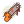
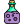

# Game Snake com temática de Halloween 

# Menu do jogo

```   
    O menu possui quatro opções e elas devem ser controladas através das "setinhas" do teclado, e escolhidas 
    através da tecla "Enter".
```   
    
### Opções do menu 
```java
    Comum Pumpkin
    Kitty Ghost
    Star Dracula
    Quit 
```   

# Modos de jogo
### Comum Pumpkin:

```   
    Snake classica, sem habilidades especiais. 
    Está snake não pode atravessar as bordas do jogo, o obstáculo da tela e nem a si mesma
```   
    
### Kitty Ghost:

```   
    Está snake pode atravessar o obstáculo da tela, mas não pode atravessar as bordas do jogo e nem a si mesma.
```   
    
### Star Dracula:

```   
    Recebe o dobro de pontos ao comer as frutas.
    Está snake pode atravessar as bordas do jogo, mas não pode atravessar o obstáculo da tela e nem a si mesma.
```   
* ***Todas as snakes são controladas usando as "setinhas" do teclado***
    
# Tipos de frutas

```Simple Candy```
  **Doce comum, dá um ponto e aumenta o tamanho da Snake.**


```Big Pumpkin```
  **Dá o dobro de pontos da Simple Candy e aumenta o tamanho da Snake da mesma forma que a Simple Candy.**


```Decrease Saw```
 **Diminui o tamanho da Snake para o tamanho inicial, sem fornecer nem retirar pontos.**


```Bomb Poison```
  **Veneno que causa a morte da Snake.**


* As frutas aparecem em locais aleatórios do mapa. 
* Elas ficam na tela por volta de 8 a 9 segundos, quando este tempo acaba, a fruta desaparece e surgi outra. 
* Existe uma probalidade de cada fruta surgir:

```java
Simple Candy: 40%

Big Pumpkin: 20%

Decrease Saw: 13.3%

Bomb Poison: 26.6%
```

# Obstáculo
### *Castle*
   **Obstáculo na tela, que causa a morte da Snake (com exeção da Kitty Ghost).**

